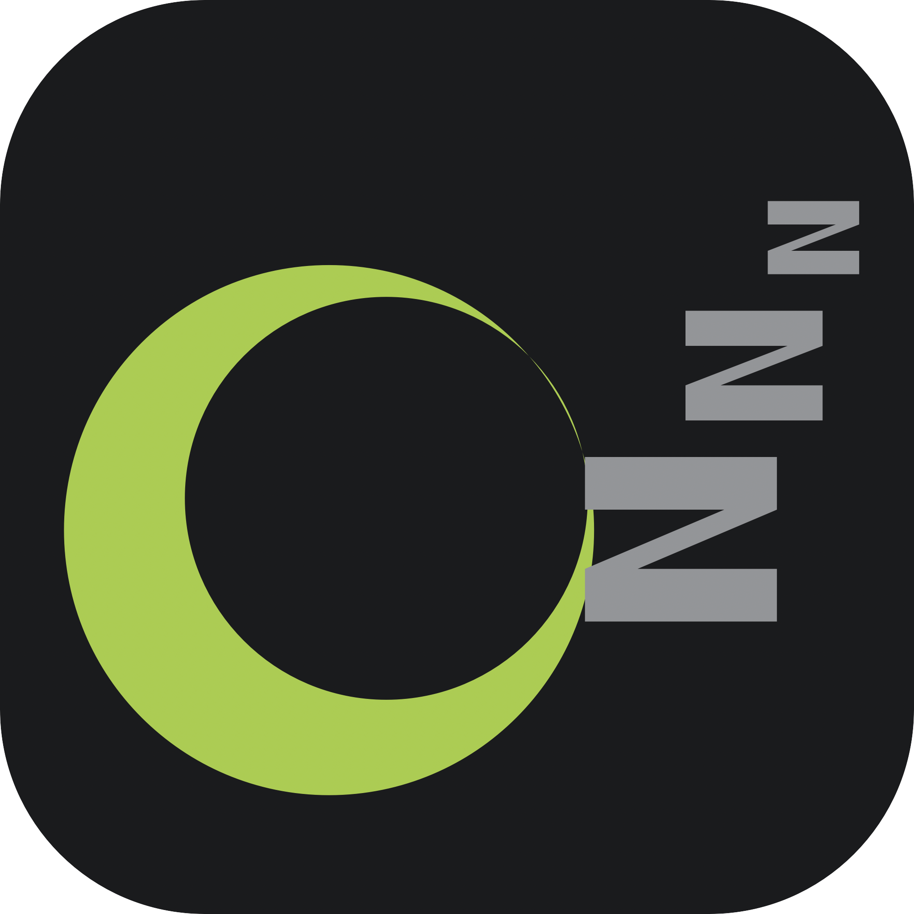
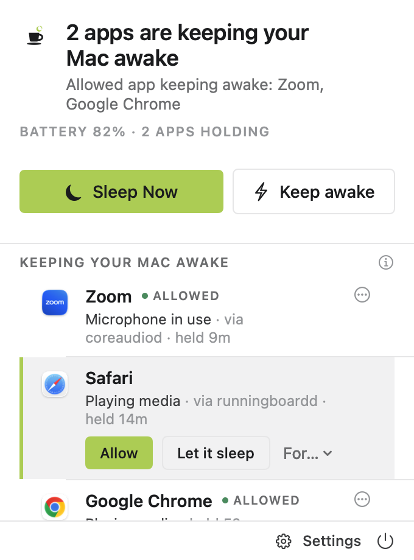
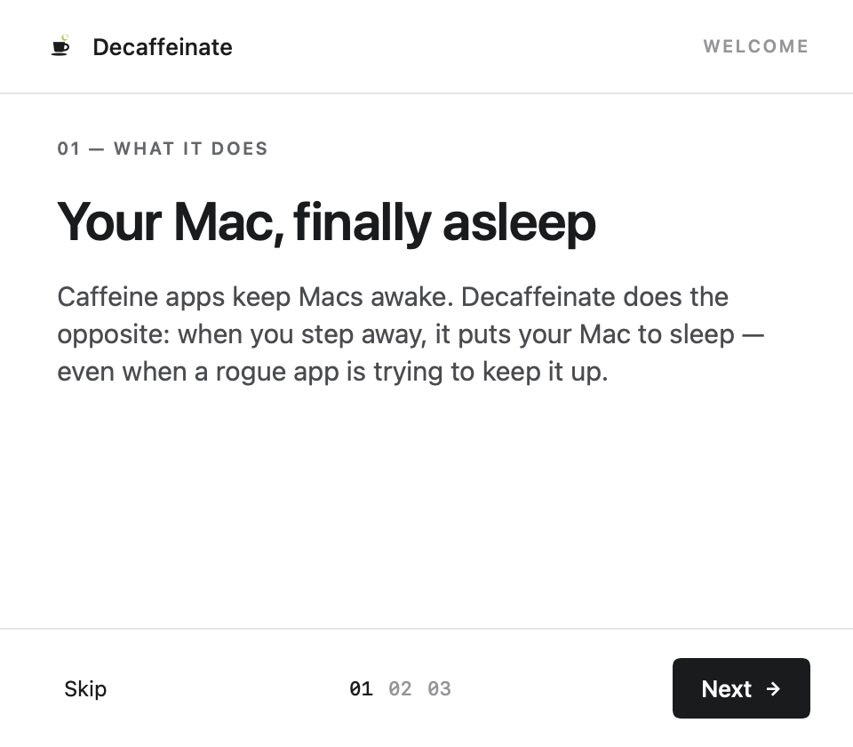
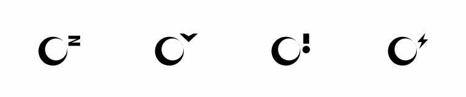
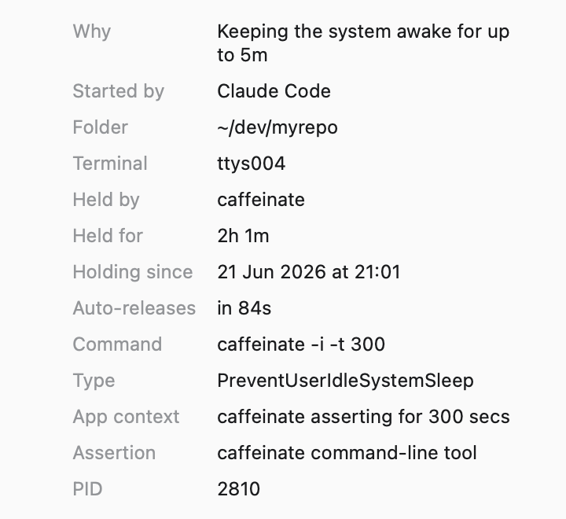

<div align="center">



# Decaffeinate

### The first Mac utility built to make your Mac **sleep** — not stay awake.

**Decaffeinate tells you the truth about what's keeping your Mac awake, and gives you the power to put it to sleep — even when rogue apps, stray `caffeinate` processes, and background tabs refuse to let go.**

> ### Your AI agent finished an hour ago — but your MacBook never slept.
> Decaffeinate is the fix.

[](https://github.com/harf-promo/decaffeinate/actions/workflows/ci.yml)
[](LICENSE)


</div>

---

## ☕️ → 💤 Why this exists

There are *dozens* of Mac apps that keep your computer awake. Amphetamine, Caffeine, KeepingYouAwake, `caffeinate` — a whole genre dedicated to **fighting sleep**.

There is almost nothing built for the opposite, far more common problem:

> You walked away. Your agent finished its task an hour ago. But your MacBook is still wide awake on the desk — fans spinning, battery draining, OLED aging — because *something* asked it to stay up and never let go.

This happens constantly in the age of agentic coding. You kick off a long job in **Claude Code**, Cursor, a big `xcodebuild`, a Docker build, or a download — these tools (rightly) hold a *power assertion* so the Mac doesn't sleep mid-work. The problem is what happens **after** the work is done: the assertion gets left behind, a terminal stays "busy," a browser tab keeps an audio line open, or you forgot a `caffeinate` running in some tab. macOS gives you **no built-in way** to see these, question them, or override them — short of force-quitting the app.

> On the very machine this was built on, a quick scan found **six** stray `caffeinate` processes silently holding the Mac awake. That's the problem, live.

**Don't believe me? Run this in your terminal right now:**
```sh
pmset -g assertions | grep -c -i "Prevent.*Sleep"
```
Every match is something quietly voting to keep your Mac awake. Decaffeinate shows you *who* — and overrules them.

**Decaffeinate is the firewall for sleep.** It watches every power assertion on your system, attributes each one to the real process behind it, and — when you've stepped away and nothing important is actually happening — **forces a clean, safe sleep** regardless of who's complaining.

---

## What makes it different

|                                  | Caffeine / Amphetamine / KeepingYouAwake | **Decaffeinate** |
| -------------------------------- | :--------------------------------------: | :--------------: |
| Keep the Mac **awake**           |                    ✅                     |   ✅ (optional)   |
| Make the Mac **sleep** on demand |                    ❌                     |        ✅         |
| Force sleep **after you're idle**, overriding rogue holds |          ❌                     |        ✅         |
| Show you **what's** keeping it awake (by process) |                 ❌                     |        ✅         |
| Allow / block individual apps (a sleep firewall) |                  ❌                     |        ✅         |
| **Sleep when your build / agent finishes** |                  ❌                     |        ✅         |
| Battery-floor + overheating safety guards |                ➖                     |        ✅         |
| Headless `--scan` from the terminal |                  ❌                     |        ✅         |

Keeping a Mac awake is a one-liner. **Knowing when it's safe to sleep — and making it happen without losing your work — is the hard, useful part.** That's the part we built.

---

## What it looks like

<div align="center">

</div>

The menu shows exactly what's holding your Mac awake — **and why**: "microphone in
use (likely a call)", "playing media", "keeps the display on", "auto-releases in
N s" — even tracing a hold routed through a shared daemon back to the real app
(*Safari · via runningboardd*). Tap any row for the full detail. One-click **Sleep
Now**, auto-sleep, and keep-awake.

**A friendly first run** — a short welcome explains what it does and the safety promise:

<div align="center">

</div>

**Menu-bar at a glance** — a coffee cup tells you the state without opening the menu:

<div align="center">

</div>

> empty cup + crescent *(decaffeinated; free to sleep)* · a downward chevron *(winding down)* · full & steaming *(something's keeping it awake)* · with a bolt *(intentionally awake)*

---

## Features

### 🔎 The Truth Scanner
A live, honest list of every process holding your Mac awake — pulled straight from the kernel via `IOPMCopyAssertionsByProcess`, attributed to the real app, with the assertion type and name. No guessing.

### 💤 The Decaffeinate Engine *(the headline)*
When you've been idle past your threshold (default 10 min) and nothing important is happening, Decaffeinate puts the Mac to sleep with `pmset sleepnow` — overriding stale "keep awake" assertions. Perfect for the *"my agent finished, let the laptop rest"* moment.

### 🧱 The Sleep Firewall
New app trying to keep your Mac awake? Get a prompt: **Always Allow**, **Allow for 1 hour**, or **Block**. Build a whitelist of apps that are genuinely allowed to hold the line (Final Cut exports, big builds) and let everything else fall asleep.

### 🛟 Safety Rails
Decaffeinate refuses to sleep at a bad moment, and *forces* sleep at a dangerous one:
- **Pause** during active media/calls, Time Machine backups, and macOS updates.
- **Backpack Guard** — if the Mac is overheating (lid closed in a bag), drop every keep-awake hold and sleep immediately.
- **Battery Floor** — on battery below your floor, keep-awake overrides are released so you never wake to a dead laptop.

### ⚡️ Keep-Awake, when you actually want it
The opposite mode is one click away. Hold the Mac (and optionally the display) awake on purpose — with all the same safety rails watching your back.

### 🔬 Provenance — *which window started this?*
For every hold, Decaffeinate traces the real origin: the terminal, editor, or **AI
agent** that spawned it, the **project folder** it's running in, the controlling
TTY, and the exact command. So a stray `caffeinate` stops being a mystery — it's
*"started by **Claude Code** · in **~/dev/myrepo**"*. All from public `libproc` /
`sysctl` — no root, no private APIs.

<div align="center">

</div>

### 🤖 Built for the agentic era
AI coding agents (**Claude Code**, Cursor, …) hold the Mac awake until their work
is done. Decaffeinate understands that: it reads the agent's own `caffeinate -w`
to tell you *exactly* what it's waiting on, offers a one-click **"Sleep when it
finishes,"** and can auto-sleep the moment a watched agent's task completes.

### 🖥 Terminal-friendly
```sh
Decaffeinate --scan         # print exactly what's keeping this Mac awake
Decaffeinate --provenance   # …and trace each one to its window / agent / project
```

---

## Install

### Homebrew (recommended)
```sh
brew tap harf-promo/tap
brew trust harf-promo/tap        # one-time: Homebrew 5+ requires trusting third-party taps
brew install --cask decaffeinate
```

**Updating:** Decaffeinate updates itself via Sparkle (the menu's **Update available**
button, or Settings → Check for Updates), so the cask is marked `auto_updates true`
— which means a plain `brew upgrade` *skips* it. To force a Homebrew update:
```sh
brew update && brew upgrade --cask decaffeinate --greedy   # or: brew reinstall --cask decaffeinate
```

### Signed DMG
Download the **notarized** `Decaffeinate-<version>.dmg` from the
[Releases](https://github.com/harf-promo/decaffeinate/releases) page and drag it
to Applications. It's signed with a Developer ID and stapled, so it opens
cleanly through Gatekeeper.

### Build from source
Requires macOS 14+ and Xcode 16 / Swift 6.

```sh
git clone https://github.com/harf-promo/decaffeinate.git
cd decaffeinate
./Scripts/build-app.sh          # → build/Decaffeinate.app
open build/Decaffeinate.app
```

Or just run the scanner without installing anything:
```sh
swift run Decaffeinate --scan
```

---

## How it works (and why it's safe)

Decaffeinate is deliberately boring under the hood — that's the point of trusting it with your sleep button:

- **It reads power assertions** with the public IOKit API `IOPMCopyAssertionsByProcess`. The same data `pmset -g assertions` shows you, attributed to processes.
- **It detects idle time** with `CGEventSource` HID idle — the same signal macOS uses to dim your screen. It never sees *what* you type, only *how long ago* you last did.
- **It sleeps the Mac** by invoking `/usr/bin/pmset sleepnow` — the exact mechanism behind  > Apple menu → Sleep. The kernel performs a normal, safe sleep transition, so even apps holding "prevent idle sleep" are cleanly overridden.
- **It keeps awake** (optional) with a standard `IOPMAssertionCreateWithName` hold, released the moment it's no longer wanted.

**No kernel extension. No private APIs. No root. No telemetry. No accounts.** The only network request is the optional Sparkle update check (which fetches a signed appcast — turn it off and there's zero network). Decaffeinate runs entirely in user space and reads only the system signals it needs to do its one job. Because it shells out to `pmset` and inspects system-wide process telemetry, it lives **outside** the App Store sandbox — distributed as open source you can read, build, and audit yourself. See [`docs/ARCHITECTURE.md`](docs/ARCHITECTURE.md) for the full design.

---

## 🙌 Help build this — we're looking for you

Decaffeinate is **free, open source (MIT), and built in the open by [Harf Promo](https://github.com/harf-promo)** — and it's just getting started. We're giving it to the world because everyone with a Mac deserves to know the truth about their machine's sleep.

**We want collaborators.** If you care about Mac internals, power management, clean SwiftUI, or just hate waking up to a hot, dead laptop — there is real, high-impact work here with your name on it.

Open areas where you can make a dent today:

| Area | What's needed | Good for |
| --- | --- | --- |
| 🌍 **Localization** | Set up a string catalog and add a language | Anyone, anywhere |
| 🗓 **Schedules & quiet windows** | "Never sleep 9–5", "stay awake until 3pm" | Swift devs |
| 📊 **Sleep history & insights** | Persist forced sleeps + a "battery saved" estimate | Swift devs |
| 🔀 **Triggers & automation** | Stay awake while app X runs / on AC / above a CPU % | Power users |
| 👋 **Onboarding** | A friendly first-run explainer | Designers |
| 🌡 **Deeper sensors** | SMC temperature & fan reads for a smarter Backpack Guard | Hardware-curious folks |
| 📝 **Docs & advocacy** | Guides, blog posts, demo videos | Writers & creators |

**You can land your first PR in ~10 minutes.** The whole test suite runs with `swift test` — **no GUI, no Apple account, no signing** — so all the decision logic is contributable in minutes. Already shipped by contributors-to-be: agentic completion detection, assertion attribution, a signed/notarized/auto-updating release pipeline. Your name's next.

👉 **Start here:** read [`CONTRIBUTING.md`](CONTRIBUTING.md), browse the [roadmap](docs/ROADMAP.md), and grab a [`good first issue`](https://github.com/harf-promo/decaffeinate/labels/good%20first%20issue). Open a discussion, file an idea, or just send a PR — first-timers are genuinely welcome.

> ⭐️ Star the repo if you want a Mac that sleeps when it should. It helps more people find it — and tells us to keep building.

---

## Roadmap

**Shipped:** signed + notarized DMG, Homebrew, Sparkle auto-update · the reason engine (why each app keeps the Mac awake) · **process provenance (which window / agent / project)** · **agentic integration (Claude Code & friends — understand `caffeinate -w`, one-click "sleep when it finishes")** · schedules & quiet windows · sleep history · triggers/automation · agentic "sleep when the build finishes" detection · a Harf-design refresh + the coffee "nightcap" mark · universal (Intel + Apple Silicon) build.

**Next:** localization · homebrew/cask-core submission · SMC temperature sensors. Full list in [`docs/ROADMAP.md`](docs/ROADMAP.md).

---

## Credits & prior art

Decaffeinate stands on the shoulders of the Mac power-management community. Projects and write-ups that informed this work include
[Amphetamine](https://apps.apple.com/app/amphetamine/id937984704),
[KeepingYouAwake](https://github.com/newmarcel/KeepingYouAwake),
[Sleepless](https://github.com/Aboudjem/Sleepless),
[SleepBar](https://github.com/ddasy/SleepBar),
[PreventSleep](https://github.com/jesse-c/PreventSleep), and
[Macchiato](https://github.com/ObservedObserver/Macchiato).
Where they keep Macs awake, we set out to do the harder inverse.

## License

[MIT](LICENSE) © 2026 Harf Promo. Use it, fork it, ship it, sell it — just keep the notice.
